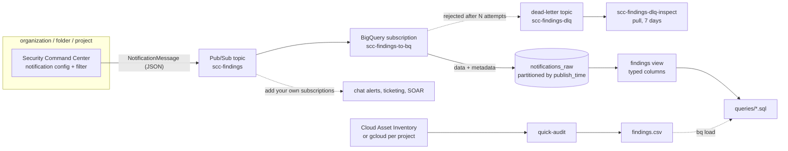

# gcp-security-findings

Two small tools for keeping an eye on a Google Cloud organization's security posture:

1. **Findings pipeline (Terraform).** A Security Command Center (SCC) notification config at
   organization, folder or project level streams findings to Pub/Sub, and a BigQuery subscription writes
   them to a day-partitioned table with a typed view and [sample queries](queries/).
2. **`quick-audit` (Python).** A dependency-free CLI that lists firewall rules and service account keys
   through Cloud Asset Inventory (one call per org) or plain `gcloud` (per project), flags SSH/RDP open
   to the internet and user-managed keys, and writes a CSV.

The pipeline gives you SCC's continuous view. The audit is the quick check you run on day one, in an
org where SCC is not set up yet, or to cross-check SCC ([query 07](queries/07_audit_vs_scc.sql)).

A pattern I implemented in consulting work, rebuilt from scratch for this portfolio. All names, IDs and
data here are fictional (`acme.example`).

## Architecture



## Layout

```
terraform/modules/scc-findings-export/   the module: SCC config, Pub/Sub, BigQuery, IAM
  schema/notifications_raw.json          raw table schema
  sql/findings_view.sql.tftpl            the typed view
  tests/                                 terraform test, mocked provider
terraform/examples/org-level/            a root module that calls it for a whole org
src/quick_audit/                         the audit CLI
tests/                                   pytest + fixtures (CAI export, gcloud output, SCC messages)
queries/                                 sample BigQuery queries, documented in queries/README.md
```

## Findings pipeline

### What the module creates

| Resource | Notes |
|---|---|
| SCC v2 notification config | Exactly one, picked by `scc_parent`: `organizations/<n>`, `folders/<n>` or `projects/<id>`. Location `global` by default (`eu`/`sa`/`us` with data residency). |
| Pub/Sub topic `scc-findings` | Message storage limited to `region`. The SCC service account gets `roles/pubsub.publisher`. |
| BigQuery subscription `scc-findings-to-bq` | No topic/table schema: the whole message goes into a `data` JSON column, with `write_metadata` on. Never expires. Retries 10 s to 600 s, then dead-letters. |
| Dead-letter topic + `-dlq-inspect` pull subscription | Holds what BigQuery rejected for 7 days. The Pub/Sub service agent can publish to it and ack on the source subscription. |
| Dataset `scc_findings` | In `region` (default `europe-west1`). |
| Table `notifications_raw` | `subscription_name`, `message_id`, `publish_time`, `attributes`, `data`. Partitioned by day on `publish_time`, partitions expire after `retention_days` (365), `require_partition_filter = true`, deletion-protected. |
| View `findings` | One row per notification with typed columns: category, severity, state, mute, event/create time, resource, project, folders, next steps, plus the full `payload`. |

### Usage

```hcl
module "scc_findings" {
  source = "./terraform/modules/scc-findings-export"

  project_id = "acme-prod-secops-5e1d"         # hosts Pub/Sub + BigQuery
  scc_parent = "organizations/100000000001"     # or folders/<n>, projects/<id>

  # optional
  findings_filter = "severity = \"CRITICAL\" OR severity = \"HIGH\" OR severity = \"MEDIUM\""  # the default
  retention_days  = 365

  labels = { env = "prod", service = "secops", owner = "platform", "cost-center" = "security" }
}
```

The default filter drops LOW findings but does not filter on `state`, so the INACTIVE update arrives
when a finding is fixed. The time-to-resolve query depends on that.

See [terraform/examples/org-level](terraform/examples/org-level/) for a full root module.

**To apply it** (not done for this repo): the Pub/Sub, BigQuery and Security Command Center APIs
enabled in the host project; the deploying identity needs `roles/securitycenter.notificationConfigEditor`
on the scope, and rights to create Pub/Sub and BigQuery resources and set IAM on them in the host
project. SCC grants its service account access to the topic when the config is created; the module
also binds `roles/pubsub.publisher` explicitly so the grant is in code.

### Why raw JSON plus a view

SCC adds finding fields regularly. With a fixed column mapping (`use_table_schema`), a message whose
shape the table does not expect fails, and goes to the dead-letter topic. Storing the message as
JSON never fails on shape, and the view pulls out the fields queries need. Adding a column is a
view change, not a table migration. The cost is that you cannot cluster on JSON fields. For large
volumes, add a scheduled query that materializes a typed table clustered by category and severity.

### Why Pub/Sub and not SCC's built-in BigQuery export

SCC can export findings to BigQuery itself, with a Google-managed schema. If BigQuery is the only
consumer, that is less to run. This module puts a topic in between, so the same stream can feed chat
alerts or a ticketing system through extra subscriptions. It also lets you choose the filter,
partitioning, retention and dead-letter handling.

## quick-audit

### Checks

| Check | Severity | Flagged when |
|---|---|---|
| `PUBLIC_SSH` | HIGH | Enabled INGRESS rule allows tcp/22 from `0.0.0.0/0` or `::/0` (protocol `all`, missing ports and port ranges count). |
| `PUBLIC_RDP` | HIGH | Same for tcp/3389 or udp/3389. |
| `USER_MANAGED_SA_KEY` | HIGH if older than `--max-key-age-days` (90), MEDIUM if newer, LOW if disabled | Any user-managed service account key. Google-managed keys are skipped. |

The 90-day default is the same threshold SCC's `SERVICE_ACCOUNT_KEY_NOT_ROTATED` uses.

### Run it

```sh
python3 -m venv .venv && .venv/bin/pip install -e '.[dev]'

# Whole organization in one Cloud Asset Inventory call (roles/cloudasset.viewer on the org)
.venv/bin/quick-audit cai --organization 100000000001 --out findings.csv

# Or a folder / a project
.venv/bin/quick-audit cai --folder 200000000020 --out findings.csv

# Without CAI: per-project gcloud calls (roles/compute.networkViewer + roles/iam.serviceAccountViewer)
.venv/bin/quick-audit gcloud --project acme-dev-web-3f9c --project acme-prod-data-7a21 --out findings.csv

# Offline: audit a saved CAI export, for example one somebody sent you
gcloud asset list --organization=100000000001 \
  --asset-types=compute.googleapis.com/Firewall,iam.googleapis.com/ServiceAccountKey \
  --content-type=resource --format=json > assets.json
.venv/bin/quick-audit cai --input assets.json --out findings.csv
```

Other options: `--fail-on HIGH|MEDIUM|LOW` returns exit code 1 when a finding is at or above that
severity (for CI), and `--now 2026-10-04` pins the reference time for key ages. Exit code 2 means a
usage or gcloud error. It uses your existing `gcloud` login and needs nothing outside the standard
library.

### Output

`check, severity, project, resource, detail, remediation`, most severe first. `resource` is a full
resource name (`//compute.googleapis.com/projects/<p>/global/firewalls/<rule>`,
`//iam.googleapis.com/projects/<p>/serviceAccounts/<sa>/keys/<id>`). Example from the fixtures:

```csv
check,severity,project,resource,detail,remediation
PUBLIC_RDP,HIGH,acme-prod-data-7a21,//compute.googleapis.com/projects/acme-prod-data-7a21/global/firewalls/allow-rdp-bastion,tcp:3389 allowed from 0.0.0.0/0 on network prod-vpc; priority 900; targets: tags rdp-bastion,Restrict source ranges (IAP TCP forwarding uses 35.235.240.0/20) or disable the rule: gcloud compute firewall-rules update allow-rdp-bastion --project=acme-prod-data-7a21 --disabled
USER_MANAGED_SA_KEY,HIGH,acme-prod-data-7a21,//iam.googleapis.com/projects/acme-prod-data-7a21/serviceAccounts/ci-deployer@acme-prod-data-7a21.iam.gserviceaccount.com/keys/1000000000000000000000000000000000000001,user-managed key for ci-deployer@acme-prod-data-7a21.iam.gserviceaccount.com; created 2025-06-01 (489 days ago); expires never; origin GOOGLE_PROVIDED,"Move the workload to Workload Identity Federation or an attached service account, then delete the key: gcloud iam service-accounts keys delete 1000000000000000000000000000000000000001 --iam-account=ci-deployer@acme-prod-data-7a21.iam.gserviceaccount.com"
```

The full expected output is [tests/fixtures/expected/findings.csv](tests/fixtures/expected/findings.csv).
The CSV describes real infrastructure, so `.gitignore` keeps `findings*.csv` at the repo root out of git.

## Tests

Everything runs offline: no credentials, no cloud calls, no cost.

```sh
# Terraform: 16 runs over org/folder/project scope, pipeline wiring, IAM and input validation
cd terraform/modules/scc-findings-export && terraform init && terraform test

# Python: checks, both sources, the CLI end to end, and the view/queries
.venv/bin/pytest
```

- `terraform test` uses `mock_provider "google"`: it checks the plan and resource wiring, not that
  Google accepts the config.
- The audit fixtures are one fictional org with three projects: a CAI export and the equivalent
  per-command `gcloud` output. The CAI file, a live CAI call (fake runner) and the per-project gcloud
  path must all produce the same reviewed [golden CSV](tests/fixtures/expected/findings.csv). The
  fixtures include rules that must *not* be flagged: IAP-only, internal, disabled, deny, egress.
- The view's JSON paths are checked against sample SCC notifications, and every query is checked for
  a `publish_time` filter, a header comment, column names that exist in the view, and an entry in
  [queries/README.md](queries/README.md).

CI ([.github/workflows/ci.yml](.github/workflows/ci.yml)) runs `terraform fmt`/`validate`/`test`,
`tflint` and `pytest`.

## Limits

- **Not applied to a real org.** The Terraform is validated and tested with a mocked provider, and the
  SQL has not been run against BigQuery.
- The firewall check looks at each VPC firewall rule on its own. It does not evaluate rule priority
  against deny rules, hierarchical firewall policies, network firewall policies, or whether any VM
  actually has the target tag. A rule shadowed by a higher-priority deny is still reported.
- "Public" means a `/0` source range. A very wide public range such as `0.0.0.0/1` is not flagged.
- Only SSH and RDP. Other risky ports (databases, Kubernetes API, and so on) are not checked.
- Which SCC detectors produce findings depends on the SCC tier and which services are enabled.
- The queries rebuild "latest state" from notifications inside their window. A finding with no
  notification in the window does not appear.
- No CMEK on the topic or dataset. Add `kms_key_name` / `default_encryption_configuration` if you
  need it.

## Sources

Public documentation used for this rebuild:

- Security Command Center: [notification configs](https://cloud.google.com/security-command-center/docs/how-to-notifications), [filtering notifications](https://cloud.google.com/security-command-center/docs/how-to-api-filter-notifications), [NotificationMessage](https://cloud.google.com/security-command-center/docs/reference/rest/v1/NotificationMessage), [Security Health Analytics findings](https://cloud.google.com/security-command-center/docs/how-to-remediate-security-health-analytics-findings)
- Pub/Sub: [BigQuery subscriptions](https://cloud.google.com/pubsub/docs/create-bigquery-subscription), [dead-letter topics](https://cloud.google.com/pubsub/docs/handling-failures)
- BigQuery: [partitioned tables](https://cloud.google.com/bigquery/docs/partitioned-tables), [JSON functions](https://cloud.google.com/bigquery/docs/reference/standard-sql/json_functions)
- Cloud Asset Inventory: [`gcloud asset list`](https://cloud.google.com/sdk/gcloud/reference/asset/list), [resource name formats](https://cloud.google.com/asset-inventory/docs/asset-names)
- Terraform: [google provider SCC v2 resources](https://registry.terraform.io/providers/hashicorp/google/latest/docs), [`terraform test` mocks](https://developer.hashicorp.com/terraform/language/tests/mocking)
- IAP TCP forwarding range: [Using IAP for TCP forwarding](https://cloud.google.com/iap/docs/using-tcp-forwarding)
